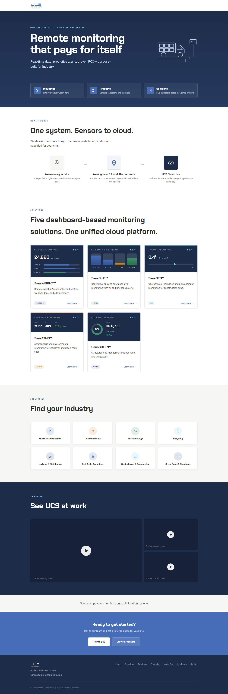
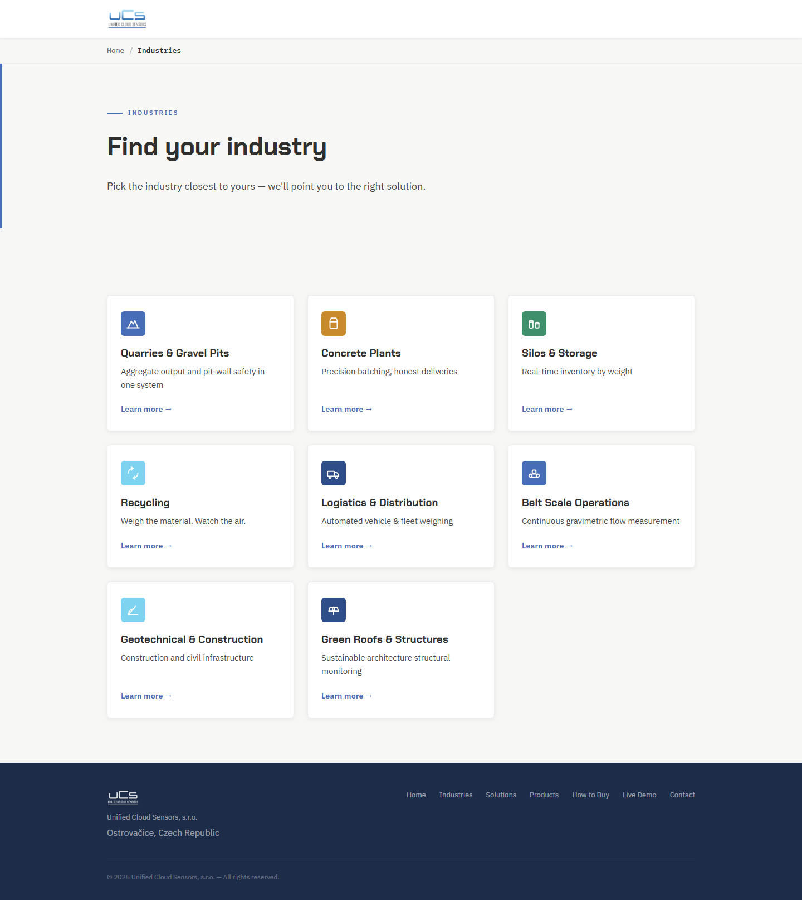
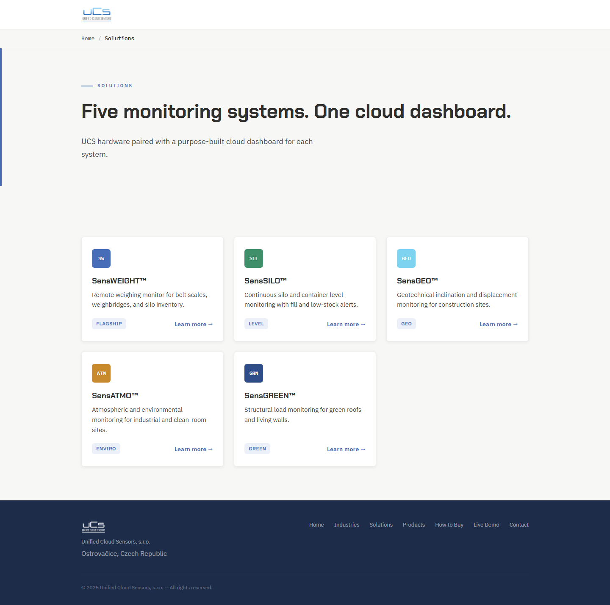
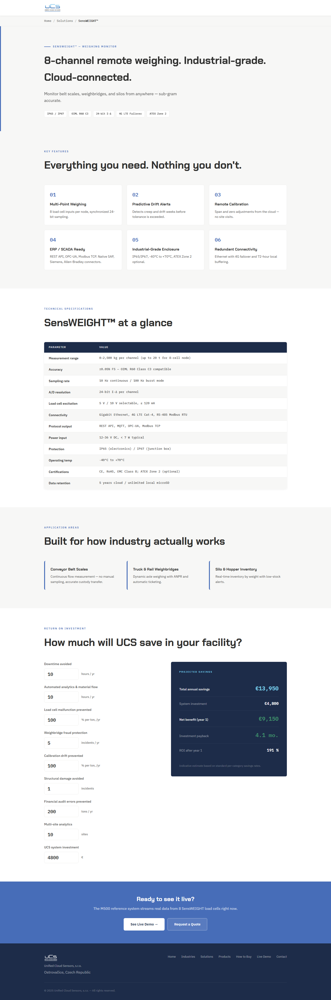
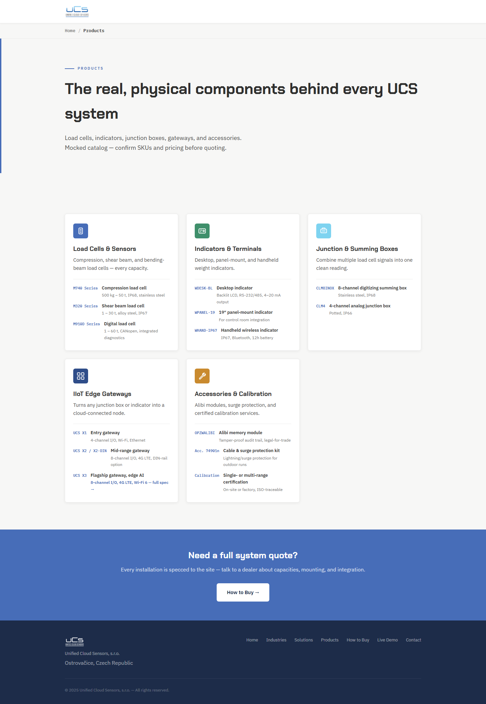
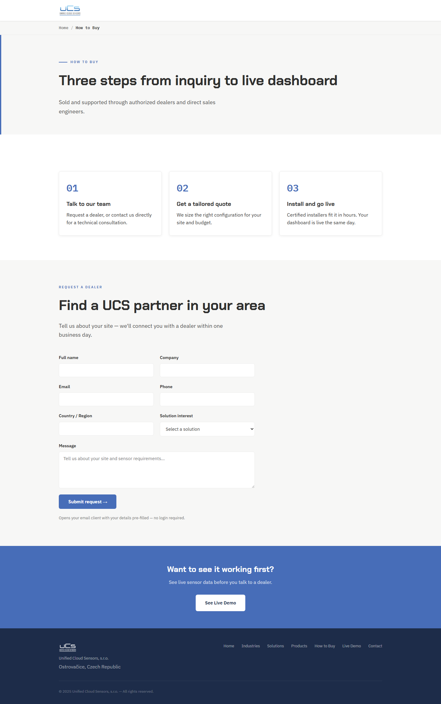

# SensWEIGHT — Site Walkthrough for Team Review

**Live site (once shared):** [paste the Vercel share link here]

**How to use this doc:** each section below is one page of the site. There's a screenshot of that page, then a short description of each step/part on it. Add your notes under any part — what you'd change, what's missing, what's confusing. We'll go through it together in the next meeting; after that, each note gets marked as integrated or not, so nothing gets lost.

When this moves to the shared Drive: paste each screenshot in as an actual image (not a link), keep the part-by-part breakdown underneath it, and leave the Notes area open for comments.

---

## 1. Home

- **Hero** — headline "Remote monitoring that pays for itself," three entry tiles: Industries / Products / Solutions.
  *Notes:*

- **How it works** — three-step flow: we assess your site → we engineer & install the hardware → UCS Cloud, live.
  *Notes:*

- **Solutions grid** — the five Sens- systems (SensWEIGHT, SensSILO, SensGEO, SensATMO, SensGREEN), one live-dashboard-style card each.
  *Notes:*

- **Find your industry** — 8 industry tiles (Quarries, Concrete, Silos, Recycling, Logistics, Belt Scale, Geotechnical, Green Roofs), links into Solutions.
  *Notes:*

- **See UCS at work** — video section, currently 3 placeholder "video coming soon" tiles.
  *Notes:*

- **ROI teaser + CTA** — one line pointing to the per-solution ROI calculators, then a closing "Ready to get started?" banner.
  *Notes:*

---

## 2. Industries index

- **Header + intro** — "Find your industry," one line explaining the page picks the right solution for you.
  *Notes:*

- **8 industry cards** — icon, name, one-line description, "Learn more" into that industry's thin page.
  *Notes:*

---

## 3. Solutions index

- **Header + intro** — "Five monitoring systems. One cloud dashboard."
  *Notes:*

- **5 solution cards** — SensWEIGHT (flagship), SensSILO, SensGEO, SensATMO, SensGREEN, each with a badge, description, "Learn more."
  *Notes:*

---

## 4. SensWEIGHT (example Solution page — same layout for the other 4)

- **Hero** — product tagline, spec chips (IP65/IP67, OIML R60 C3, 24-bit Δ-Σ, 4G LTE Failover, ATEX Zone 2).
  *Notes:*

- **Key features grid** — 6 numbered feature cards (multi-point weighing, predictive drift alerts, remote calibration, ERP/SCADA ready, industrial enclosure, redundant connectivity).
  *Notes:*

- **Technical specifications table** — full spec sheet (range, accuracy, sampling rate, connectivity, certifications, etc.).
  *Notes:*

- **Application areas** — 3 use-case blurbs (conveyor belt scales, truck & rail weighbridges, silo & hopper inventory).
  *Notes:*

- **ROI calculator** — "How much will UCS save in your facility?" — visitor enters quantities per category (downtime, fraud, calibration, etc.), gets projected annual savings/payback.
  *Notes:*

- **CTA + footer** — "Ready to see it live?" into the live demo / request a quote.
  *Notes:*

---

## 5. Products

- **Header + intro** — flags the catalog as mocked, "confirm SKUs and pricing before quoting."
  *Notes:*

- **5 hardware categories** — Load Cells & Sensors, Indicators & Terminals, Junction & Summing Boxes, IIoT Edge Gateways, Accessories & Calibration — each with a few example SKUs.
  *Notes:*

- **CTA** — "Need a full system quote?" into How to Buy.
  *Notes:*

---

## 6. How to Buy

- **Header** — "Three steps from inquiry to live dashboard."
  *Notes:*

- **3-step explainer** — talk to our team → get a tailored quote → install and go live.
  *Notes:*

- **Dealer request form** — name, company, email, phone, country, solution interest, message. Currently opens the visitor's email client (mailto) rather than submitting to a server.
  *Notes:*

- **CTA** — "Want to see it working first?" into the live demo.
  *Notes:*

---

*Pages not included here (Live Demo, individual Industry pages, UCS X3): add a section the same way if the team wants to review them too.*
